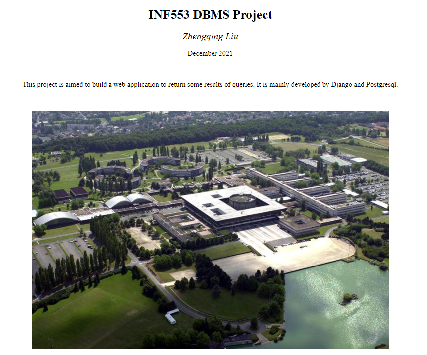
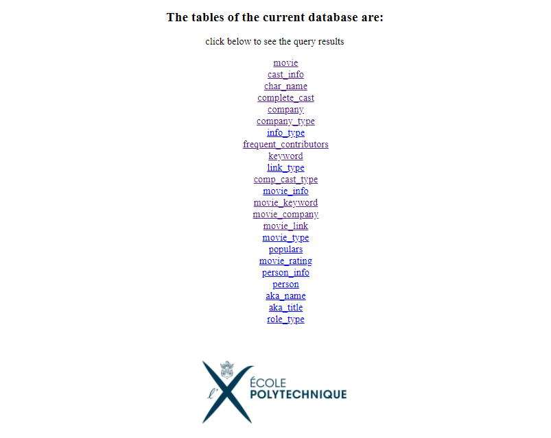
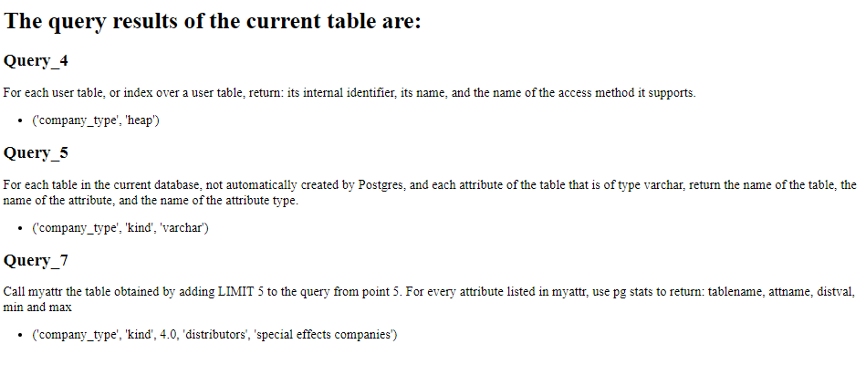

# INF553-Projet

Course: INF553 Database Management System (École Polytechnique)

Requirements: Build a Web app which, given a database name,
       
    (a) shows to users the result of one of the queries in Question 3
    (b) users should be able to click on any table names, and this should lead to a page showing the results of the queries in points 4, 5, and 7 above, restricted to that table.

## Quick Start
1. `git clone https://github.com/Scofield626/INF553-projet`
2. Database configuration
    -  Database: **movie_test**
        - create a database, *movie_test*
        - `tar -xzvf imdb-small.sql.gz`
        - `psql -f imdb-small.sql movie_test`
    - `cd inf553` and modify username, keyword as same as your settings in `views.py` line 10-12 and line 45-47
3. Run web application
    - `cd INF553-projet`
    - `python3 manage.py runserver`
    - `http://127.0.0.1:8000/inf553`

## Preview

